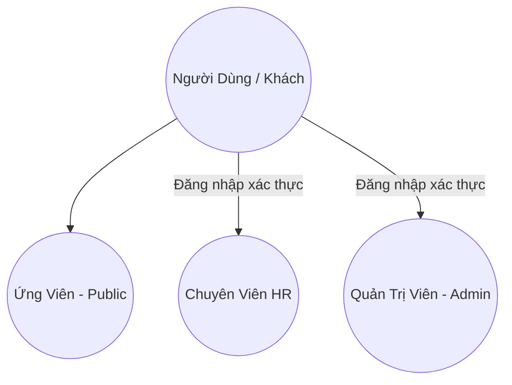
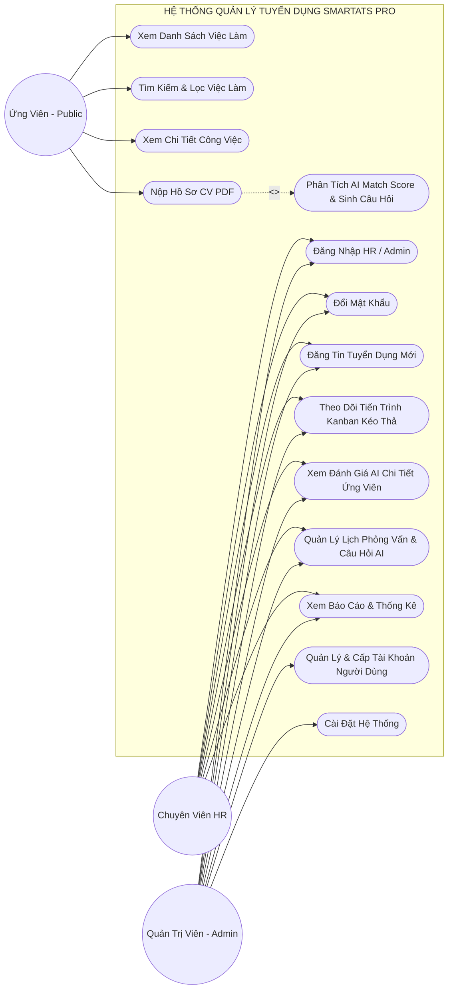
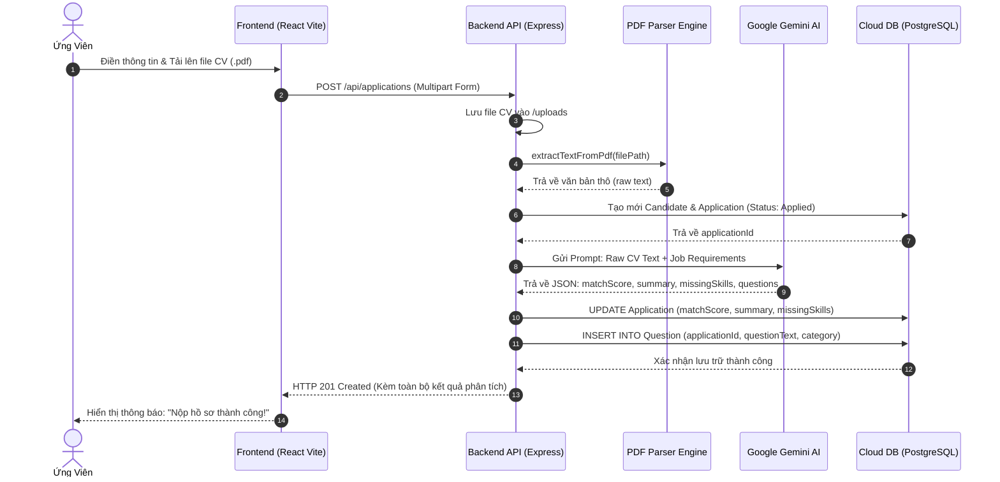
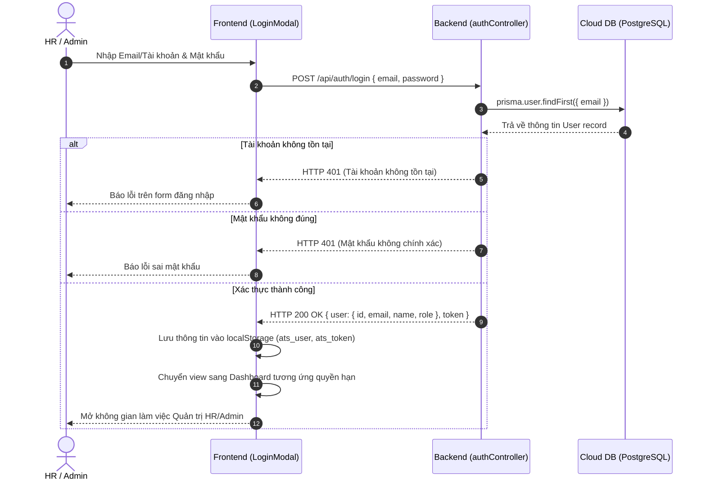
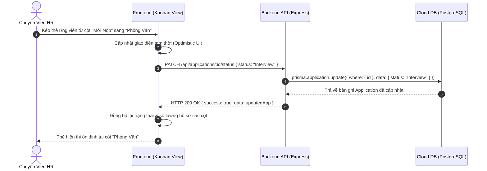
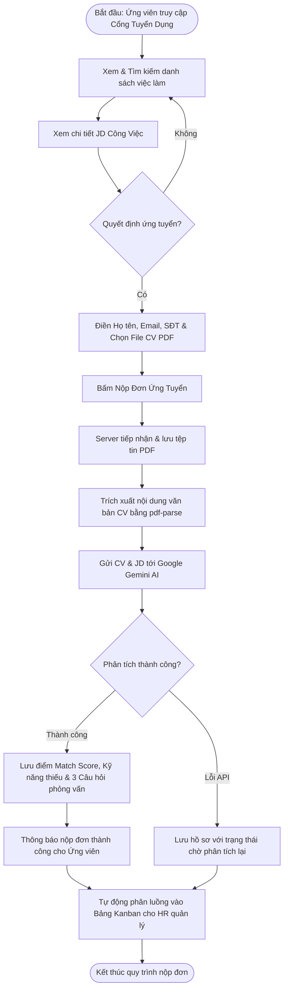
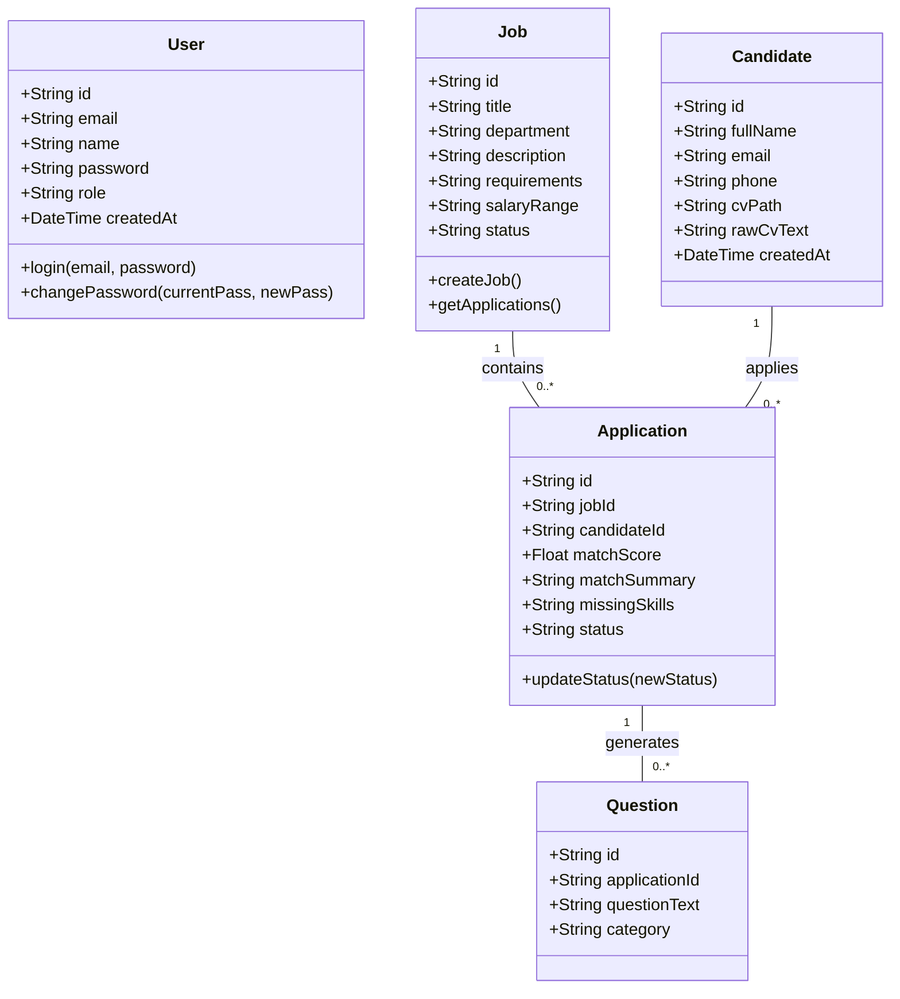
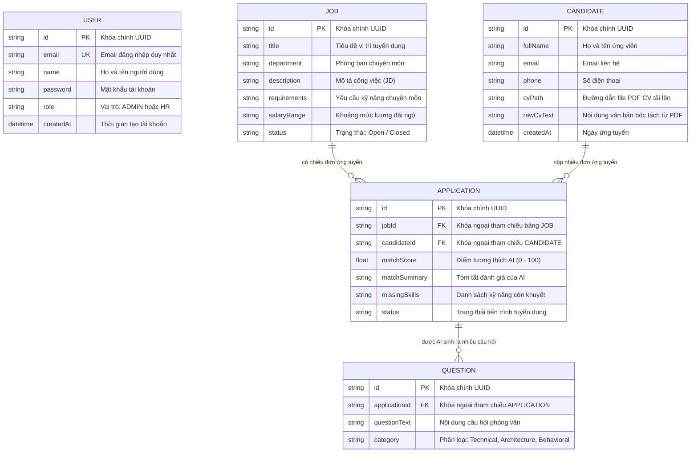
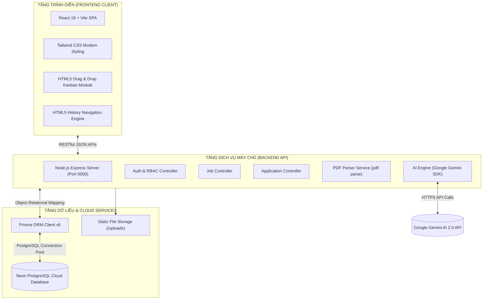

# TÀI LIỆU ĐẶC TẢ YÊU CẦU PHẦN MỀM (SRS)
## DỰ ÁN: HỆ THỐNG QUẢN LÝ TUYỂN DỤNG TÍCH HỢP TRÍ TUỆ NHÂN TẠO (SMARTATS PRO)

---

**Môn học / Học phần:** Đồ Án Chuyên Ngành / Khóa Luận Tốt Nghiệp Công Nghệ Thông Tin  
**Tên đề tài:** Xây dựng Hệ thống Quản lý Tuyển dụng Ứng viên Thông minh Tích hợp Trí tuệ Nhân tạo (SmartATS)  
**Phiên bản tài liệu:** 1.0 (Giai đoạn Báo cáo Sơ bộ & Thiết kế Hệ thống)  
**Ngày lập:** Tháng 08/2026  
**Trạng thái:** Bản phác thảo chuẩn (Có thể mở rộng và bổ sung tiếp)  

---

## MỤC LỤC TỔNG QUAN

1. **CHƯƠNG 1: TỔNG QUAN ĐỀ TÀI VÀ BỐI CẢNH DỰ ÁN**
   - 1.1. Đặt vấn đề & Thực trạng quy trình tuyển dụng
   - 1.2. Mục đích và Ý nghĩa đề tài
   - 1.3. Mục tiêu nghiên cứu và Phạm vi dự án
   - 1.4. Đối tượng sử dụng & Lợi ích mang lại
2. **CHƯƠNG 2: YÊU CẦU HỆ THỐNG (SYSTEM REQUIREMENTS)**
   - 2.1. Phân loại vai trò người dùng (Actor Definition)
   - 2.2. Yêu cầu chức năng (Functional Requirements - FR)
   - 2.3. Yêu cầu phi chức năng (Non-Functional Requirements - NFR)
   - 2.4. Quy trình nghiệp vụ cốt lõi (Business Workflow)
3. **CHƯƠNG 3: MÔ HÌNH HÓA VÀ THIẾT KẾ HỆ THỐNG (UML MODELING)**
   - 3.1. Biểu đồ Use Case tổng quát & Phân rã
   - 3.2. Đặc tả chi tiết các Use Case chính
   - 3.3. Biểu đồ Tuần tự (Sequence Diagrams)
   - 3.4. Biểu đồ Hoạt động (Activity Diagrams)
   - 3.5. Biểu đồ Lớp (Class Diagram)
4. **CHƯƠNG 4: THIẾT KẾ CƠ SỞ DỮ LIỆU (DATABASE & ERD)**
   - 4.1. Biểu đồ Thực thể - Mối quan hệ (ERD Diagram)
   - 4.2. Từ điển dữ liệu chi tiết (Data Dictionary)
   - 4.3. Ràng buộc toàn vẹn và Chiến lược đồng bộ Cloud (Neon PostgreSQL)
5. **CHƯƠNG 5: KIẾN TRÚC HỆ THỐNG & CÔNG NGHỆ TRIỂN KHAI**
   - 5.1. Kiến trúc tổng thể Monorepo Client-Server
   - 5.2. Công nghệ Frontend (React, Vite, Tailwind CSS, History API, HTML5 DnD)
   - 5.3. Công nghệ Backend (Node.js, Express, Prisma ORM, PostgreSQL)
   - 5.4. Tích hợp Trí tuệ nhân tạo (Google Gemini AI & PDF Parsing Engine)
6. **CHƯƠNG 6: KỊCH BẢN KIỂM THỬ SƠ BỘ (TEST CASES)**
7. **CHƯƠNG 7: KẾT LUẬN & HƯỚNG PHÁT TRIỂN TIẾP THEO**

---

# CHƯƠNG 1: TỔNG QUAN ĐỀ TÀI VÀ BỐI CẢNH DỰ ÁN

## 1.1. Đặt vấn đề & Thực trạng quy trình tuyển dụng
Trong kỷ nguyên chuyển đổi số và thị trường lao động cạnh tranh gay gắt, công tác tuyển dụng nhân sự (Talent Acquisition) đóng vai trò sống còn đối với sự phát triển của mọi doanh nghiệp. Tuy nhiên, quy trình tuyển dụng truyền thống tại nhiều tổ chức hiện nay đang gặp phải các bất cập lớn:
1. **Quá tải hồ sơ (Resume Overload):** Một vị trí tuyển dụng IT/Tech có thể nhận về hàng trăm CV ở định dạng PDF/Word không đồng nhất. Bộ phận HR phải đọc thủ công từng CV, dẫn đến tiêu tốn hàng chục giờ làm việc mỗi tuần và dễ bỏ sót nhân tài.
2. **Đánh giá thiếu khách quan và chậm trễ:** Việc đánh giá độ phù hợp giữa CV và Bản mô tả công việc (JD) thủ công phụ thuộc nhiều vào cảm quan cá nhân của chuyên viên tuyển dụng, khó lượng hóa thành điểm số chính xác.
3. **Thiếu công cụ quản lý tiến trình trực quan:** Việc theo dõi ứng viên qua các vòng (Mới nộp -> Sàng lọc -> Phỏng vấn -> Đề xuất -> Trúng tuyển) qua bảng tính Excel rời rạc gây khó khăn cho việc cộng tác giữa HR và người phỏng vấn chuyên môn.
4. **Chuẩn bị câu hỏi phỏng vấn thiếu cá nhân hóa:** Người phỏng vấn mất nhiều thời gian để soạn bộ câu hỏi kỹ thuật xoay quanh chính các dự án và kỹ năng còn khuyết của từng ứng viên cụ thể.

## 1.2. Mục đích và Ý nghĩa đề tài
Đề tài **"Hệ thống Quản lý Tuyển dụng Tích hợp Trí tuệ Nhân tạo (SmartATS Pro)"** được xây dựng nhằm giải quyết triệt để các vấn đề trên bằng cách ứng dụng công nghệ xử lý văn bản tự động và Mô hình Ngôn ngữ Lớn (LLM - Google Gemini AI). Hệ thống số hóa toàn diện quy trình tuyển dụng từ tiếp nhận hồ sơ công khai, tự động phân tích điểm tương thích, quản lý tiến trình dạng bảng Kanban kéo thả, đến quản trị tài khoản phân quyền bảo mật.

## 1.3. Mục tiêu nghiên cứu và Phạm vi dự án
* **Mục tiêu kỹ thuật:**
  * Xây dựng Single Page Application (SPA) hiện đại với React, Vite và Tailwind CSS, hỗ trợ giao diện Dark/Light mode, điều hướng mượt mà với HTML5 History API.
  * Xây dựng Backend RESTful API với Node.js, Express, ORM Prisma và Cơ sở dữ liệu Cloud PostgreSQL (Neon).
  * Tích hợp AI Engine bóc tách CV (`pdf-parse`) và chấm điểm `AI Match Score (0-100%)`, tự động tổng kết điểm mạnh, kỹ năng còn thiếu và sinh ngân hàng câu hỏi phỏng vấn gợi ý.
* **Phạm vi dự án (Scope of Work):**
  * Hệ thống triển khai theo mô hình Monorepo (Client + Server).
  * Phục vụ 3 nhóm đối tượng: **Ứng viên (User / Candidate)**, **Chuyên viên Tuyển dụng (HR)**, và **Quản trị viên Hệ thống (Admin / IT)**.

## 1.4. Đối tượng sử dụng & Lợi ích mang lại
* **Ứng viên (Candidate):** Không cần tạo tài khoản rườm rà; xem việc làm trực quan, nộp CV 1 chạm và nhận phản hồi phân tích tức thì từ AI.
* **HR Recruiter:** Tiết kiệm 70% thời gian lọc CV, quản lý hồ sơ ứng viên trực quan trên Bảng theo dõi kéo thả (Kanban), chuẩn bị phỏng vấn nhanh với câu hỏi AI gợi ý.
* **Admin / Doanh nghiệp:** Nắm bắt số liệu báo cáo tuyển dụng thời gian thực, toàn quyền quản trị tài khoản thành viên nội bộ, cấu hình trọng số tuyển dụng và cơ cấu tổ chức.

---

# CHƯƠNG 2: YÊU CẦU HỆ THỐNG (SYSTEM REQUIREMENTS)

## 2.1. Phân loại vai trò người dùng (Actors)

1. **Ứng viên (Candidate - Public Actor):**
   * Người dùng vãng lai truy cập website. Không bắt buộc đăng nhập tài khoản.
   * Quyền hạn: Xem danh sách việc làm, tìm kiếm, lọc theo phòng ban/mức lương, xem chi tiết JD, tải lên file CV PDF để ứng tuyển.
2. **Chuyên viên Tuyển dụng (HR Recruiter):**
   * Nhân sự nội bộ đã được cấp tài khoản. Phải đăng nhập bằng Email/Password.
   * Quyền hạn: Quản lý tin tuyển dụng (Jobs), xem danh sách hồ sơ, xem kết quả phân tích AI Match Score, kéo thả thẻ ứng viên trên Bảng theo dõi Kanban, quản lý lịch phỏng vấn & ngân hàng câu hỏi AI, xem báo cáo thống kê, đổi mật khẩu cá nhân.
3. **Quản trị viên Hệ thống (System Admin):**
   * Quyền hạn cao nhất trong hệ thống.
   * Toàn bộ quyền của HR + Quyền **Quản Trị Tài Khoản** (Cấp tài khoản mới cho HR/Admin, xoá tài khoản), Quản lý cấu hình trọng số AI và cơ cấu phòng ban tổ chức.

---

## 2.2. Yêu cầu chức năng (Functional Requirements - FR)

### Nhóm FR1: Phân hệ Ứng viên & Cổng Tuyển dụng (Candidate Portal)
* **FR1.1 (Xem danh sách việc làm):** Hiển thị danh sách các tin tuyển dụng đang mở (`Open`) kèm tiêu đề, phòng ban, mức lương, yêu cầu tóm tắt.
* **FR1.2 (Tìm kiếm & Bộ lọc):** Cho phép tìm kiếm công việc theo từ khóa kỹ năng, lọc nhanh theo phòng ban (`Engineering`, `AI Lab`, `Product & Design`, `Marketing`, `HR & Operations`).
* **FR1.3 (Xem chi tiết công việc):** Xem đầy đủ Mô tả công việc (JD), Yêu cầu chuyên môn, Phúc lợi.
* **FR1.4 (Nộp hồ sơ ứng tuyển):** Form nhập thông tin cá nhân (Họ tên, Email, Số điện thoại) và tải lên tệp tin CV định dạng PDF.
* **FR1.5 (Tự động kích hoạt AI Match):** Khi ứng viên nộp CV, hệ thống tự động bóc tách text PDF, so khớp với JD và lưu trữ kết quả phân tích.

### Nhóm FR2: Phân hệ Xác thực & Quản trị Tài khoản (Authentication & RBAC)
* **FR2.1 (Đăng nhập phân quyền):** Đăng nhập với Email và Mật khẩu dành cho HR và Admin. Trả về JWT Token và thông tin định danh vai trò.
* **FR2.2 (Đổi mật khẩu cá nhân):** Cho phép người dùng đang đăng nhập đổi mật khẩu (xác thực mật khẩu hiện tại và kiểm tra mật khẩu mới).
* **FR2.3 (Quản lý danh sách tài khoản - Admin only):** Hiển thị danh sách tất cả tài khoản trong hệ thống kèm thống kê số lượng Admin/HR.
* **FR2.4 (Cấp tài khoản mới - Admin only):** Admin nhập Họ tên, Email, Mật khẩu khởi tạo và phân quyền vai trò (`HR` hoặc `ADMIN`).
* **FR2.5 (Xoá tài khoản - Admin only):** Admin có quyền xoá tài khoản thành viên (bảo vệ chống tự xoá tài khoản của chính mình).
* **FR2.6 (Đăng xuất):** Hủy phiên làm việc và điều hướng về trang ứng viên công khai.

### Nhóm FR3: Phân hệ Quản trị Tuyển dụng (HR & Management Dashboard)
* **FR3.1 (Dashboard Tổng quan):** Thống kê số lượng Jobs, Hồ sơ ứng viên, Buổi phỏng vấn, Điểm tương thích trung bình và biểu đồ trạng thái.
* **FR3.2 (Quản lý Tin tuyển dụng):** Tạo tin tuyển dụng mới, xem chi tiết, chỉnh sửa thông tin việc làm và số lượng hồ sơ nộp vào từng job.
* **FR3.3 (Bảng Theo Dõi Tuyển Dụng - Kanban Pipeline):**
  * Hiển thị ứng viên theo 5 cột tiến trình: `1. Mới Nộp (Applied)` -> `2. AI Sàng Lọc` -> `3. Phỏng Vấn (Interview)` -> `4. Đề Xuất (Offered)` -> `5. Đã Tuyển (Hired)`.
  * Hỗ trợ thao tác kéo & thả (HTML5 Drag and Drop) trực quan để chuyển trạng thái ứng viên giữa các cột.
  * Hỗ trợ các nút chuyển trạng thái nhanh (`Phỏng Vấn →`, `Mời PV →`, `Đề Xuất →`, `Nhận Việc ✓`).
* **FR3.4 (Chi tiết Đánh giá Hồ sơ Ứng viên & AI Match):**
  * Xem thông tin ứng viên, điểm số tương thích `Match Score (%)`.
  * Xem tóm tắt phân tích của AI (`Match Summary`), danh sách kỹ năng còn thiếu (`Missing Skills`).
  * Xem và tải file CV PDF gốc trực tiếp trên giao diện.
* **FR3.5 (Lịch Phỏng Vấn & Ngân hàng Câu hỏi AI):**
  * Quản lý danh sách ứng viên trong vòng phỏng vấn.
  * Hiển thị bộ câu hỏi phỏng vấn được AI tự động sinh riêng cho từng ứng viên (phân loại: Chuyên môn kỹ thuật, Kiến trúc hệ thống, Văn hóa ứng xử).
* **FR3.6 (Báo cáo & Thống kê Analytics):** Biểu đồ phân bổ điểm tương thích, tỷ lệ chuyển đổi qua các vòng tuyển dụng.
* **FR3.7 (Cơ cấu Phòng Ban & Cài Đặt Trọng Số):** Xem cấu trúc tổ chức và tinh chỉnh thông số chấm điểm.

---

## 2.3. Yêu cầu phi chức năng (Non-Functional Requirements - NFR)
* **NFR1 - Hiệu năng (Performance):** 
  * Thời gian phản hồi API trung bình dưới 300ms cho các truy vấn dữ liệu chuẩn.
  * Thời gian phân tích CV bằng AI dưới 5 giây.
* **NFR2 - Tính sẵn sàng & Đám mây (Availability & Cloud):**
  * Cơ sở dữ liệu lưu trữ trực tiếp trên Cloud PostgreSQL (Neon) đảm bảo hoạt động 24/7.
  * Hỗ trợ cơ chế Smart Demo Fallback khi mất kết nối mạng.
* **NFR3 - Bảo mật (Security):**
  * Mật khẩu được kiểm tra hợp lệ, hỗ trợ phân quyền chặt chẽ theo vai trò (RBAC).
  * Bảo vệ chống lỗi tự xóa tài khoản của chính mình đối với Admin.
* **NFR4 - Trải nghiệm người dùng (UX/UI Excellence):**
  * Giao diện thiết kế theo phong cách hiện đại (Modern SaaS Dashboard), hỗ trợ Theme Sáng/Tối (Light/Dark mode).
  * Tích hợp điều hướng Browser History API (Back/Forward không bị reload hay văng khỏi trang web).
  * Tương thích tốt trên màn hình máy tính và thiết bị di động (Responsive Layout).

---

# CHƯƠNG 3: MÔ HÌNH HÓA VÀ THIẾT KẾ HỆ THỐNG (UML MODELING)

## 3.1. Biểu đồ Use Case Tổng Quát

---

## 3.2. Đặc tả Chi tiết các Use Case Trọng tâm

### Đặc tả Use Case UC4 & UC5: Nộp Hồ Sơ CV & Phân Tích AI Match
* **Mã Use Case:** `UC-APPLY-01`
* **Tên Use Case:** Nộp Đơn Ứng Tuyển & Kích Hoạt AI Sàng Lọc
* **Tác nhân:** Ứng viên (Candidate)
* **Mô tả:** Ứng viên điền thông tin cá nhân và tải lên file CV PDF cho một vị trí công việc. Hệ thống tiếp nhận, lưu file, bóc tách text và kích hoạt Google Gemini AI chấm điểm tương thích.
* **Tiền điều kiện:** Vị trí tuyển dụng đang ở trạng thái `Open`.
* **Luồng sự kiện chính (Main Flow):**
  1. Ứng viên bấm nút "Ứng Tuyển" tại một vị trí công việc.
  2. Hệ thống hiển thị modal biểu mẫu nộp hồ sơ.
  3. Ứng viên nhập Họ tên, Email, Số điện thoại và đính kèm file CV định dạng `.pdf`.
  4. Ứng viên bấm "Gửi Hồ Sơ Ứng Tuyển".
  5. Client gửi `multipart/form-data` lên endpoint `POST /api/applications`.
  6. Server lưu trữ file CV vào thư mục `/uploads`.
  7. Module `pdfService` trích xuất toàn bộ văn bản thô từ file PDF.
  8. Module `aiService` gửi văn bản CV cùng yêu cầu công việc (JD Requirements) tới Google Gemini API.
  9. AI trả về JSON: Điểm tương thích (`matchScore`), Tóm tắt đánh giá (`summary`), Kỹ năng còn thiếu (`missingSkills`) và 3 câu hỏi phỏng vấn chuyên sâu.
  10. Server lưu kết quả vào bảng `Application` và `Question`.
  11. Hệ thống thông báo nộp đơn thành công cho ứng viên.
* **Hậu điều kiện:** Đơn ứng tuyển được tạo mới với điểm số AI, hiển thị trong Bảng Theo Dõi Tuyển Dụng của HR.

### Đặc tả Use Case UC9: Kéo Thả Thẻ Trên Bảng Theo Dõi Kanban
* **Mã Use Case:** `UC-KANBAN-01`
* **Tên Use Case:** Cập Nhật Tiến Trình Tuyển Dụng Bằng Kéo Thả
* **Tác nhân:** Chuyên viên HR, Admin
* **Mô tả:** Người dùng kéo thẻ ứng viên từ cột này và thả sang cột giai đoạn khác để cập nhật trạng thái tuyển dụng tức thì.
* **Tiền điều kiện:** Đã đăng nhập vào hệ thống và đang ở màn hình Bảng Theo Dõi Tuyển Dụng.
* **Luồng sự kiện chính:**
  1. HR rê chuột vào thẻ ứng viên, nhấn giữ chuột trái (sự kiện `dragstart`).
  2. Thẻ chuyển sang hiệu ứng mờ và viền nét đứt.
  3. HR kéo thẻ qua cột mục tiêu (ví dụ: `3. Phỏng Vấn (Interview)`).
  4. Cột mục tiêu kích hoạt hiệu ứng sáng viền cam và hiện khung `+ Thả vào đây` (`dragover`).
  5. HR thả chuột (`drop`).
  6. Client gửi yêu cầu `PATCH /api/applications/:id/status` với trạng thái mới.
  7. Server cập nhật trường `status` trong database và trả về kết quả thành công.
  8. Bảng Kanban tự động cập nhật số lượng hồ sơ trong từng cột.

### Đặc tả Use Case UC13: Quản Lý & Cấp Tài Khoản Người Dùng (Admin Only)
* **Mã Use Case:** `UC-ADMIN-USER-01`
* **Tên Use Case:** Cấp Mới và Xóa Tài Khoản Quản Trị
* **Tác nhân:** Quản trị viên (Admin)
* **Mô tả:** Admin tạo tài khoản mới cho HR hoặc Admin khác, hoặc xóa quyền truy cập của tài khoản không còn hoạt động.
* **Tiền điều kiện:** Người dùng đăng nhập có vai trò `role === 'ADMIN'`.
* **Luồng sự kiện chính:**
  1. Admin mở tab "Quản Lý Tài Khoản".
  2. Hệ thống tải danh sách toàn bộ tài khoản từ `GET /api/auth/users`.
  3. Khi bấm "+ Cấp Tài Khoản Mới": Nhập Tên, Email, Mật khẩu, Chọn vai trò (`HR` hoặc `ADMIN`) -> Gửi `POST /api/auth/users`.
  4. Khi bấm icon Xóa tài khoản: Hệ thống kiểm tra ID cần xóa khác với ID đang đăng nhập (bảo vệ chống tự xóa), xác nhận với người dùng và gửi `DELETE /api/auth/users/:id`.

---

## 3.3. Biểu đồ Tuần tự (Sequence Diagrams)

### Sequence Diagram 1: Quy trình Nộp CV & Phân Tích AI

---

### Sequence Diagram 2: Quy trình Đăng Nhập Phân Quyền (RBAC Login)

---

### Sequence Diagram 3: Quy trình Kéo Thả Thẻ Trên Kanban Pipeline

---

## 3.4. Biểu đồ Hoạt động (Activity Diagram)

---

## 3.5. Biểu đồ Lớp Phân Tích (Class Diagram)

---

# CHƯƠNG 4: THIẾT KẾ CƠ SỞ DỮ LIỆU (DATABASE & ERD)

## 4.1. Biểu đồ Thực thể - Mối quan hệ (ERD Diagram)

---

## 4.2. Từ điển Dữ liệu Chi tiết (Data Dictionary)

### Bảng 1: `User` (Tài khoản Quản trị & Nhân sự)
| Tên thuộc tính | Kiểu dữ liệu | Khóa | Cho phép NULL | Mô tả |
| :--- | :--- | :---: | :---: | :--- |
| `id` | `VARCHAR(36)` / UUID | **PK** | Không | Mã định danh duy nhất của tài khoản |
| `email` | `VARCHAR(255)` | **UK** | Không | Email dùng để đăng nhập hệ thống |
| `name` | `VARCHAR(255)` | | Không | Họ tên đầy đủ của thành viên |
| `password` | `VARCHAR(255)` | | Không | Mật khẩu xác thực tài khoản |
| `role` | `VARCHAR(20)` | | Không | Vai trò phân quyền: `ADMIN` hoặc `HR` |
| `createdAt` | `DATETIME` | | Không | Thời điểm tạo tài khoản (Mặc định: `now()`) |

### Bảng 2: `Job` (Tin Tuyển Dụng)
| Tên thuộc tính | Kiểu dữ liệu | Khóa | Cho phép NULL | Mô tả |
| :--- | :--- | :---: | :---: | :--- |
| `id` | `VARCHAR(36)` / UUID | **PK** | Không | Mã định danh duy nhất của công việc |
| `title` | `VARCHAR(255)` | | Không | Tên vị trí việc làm tuyển dụng |
| `department` | `VARCHAR(100)` | | Không | Tên phòng ban (`Engineering`, `AI Lab`...) |
| `description` | `TEXT` | | Không | Mô tả chi tiết nhiệm vụ công việc |
| `requirements` | `TEXT` | | Không | Yêu cầu kỹ năng, công nghệ, số năm kinh nghiệm |
| `salaryRange` | `VARCHAR(100)` | | Không | Mức lương đãi ngộ (Ví dụ: `$1,500 - $2,500`) |
| `status` | `VARCHAR(50)` | | Không | Trạng thái tin đăng (`Open` hoặc `Closed`) |

### Bảng 3: `Candidate` (Thông tin Ứng Viên)
| Tên thuộc tính | Kiểu dữ liệu | Khóa | Cho phép NULL | Mô tả |
| :--- | :--- | :---: | :---: | :--- |
| `id` | `VARCHAR(36)` / UUID | **PK** | Không | Mã định danh ứng viên |
| `fullName` | `VARCHAR(255)` | | Không | Họ và tên ứng viên |
| `email` | `VARCHAR(255)` | | Không | Địa chỉ thư điện tử của ứng viên |
| `phone` | `VARCHAR(50)` | | Có | Số điện thoại liên hệ |
| `cvPath` | `VARCHAR(500)` | | Có | Đường dẫn lưu trữ tệp tin CV PDF trên server |
| `rawCvText` | `TEXT` | | Có | Văn bản thô được trích xuất từ file PDF |
| `createdAt` | `DATETIME` | | Không | Thời điểm nộp hồ sơ |

### Bảng 4: `Application` (Hồ Sơ Ứng Tuyển & Điểm Đánh Giá AI)
| Tên thuộc tính | Kiểu dữ liệu | Khóa | Cho phép NULL | Mô tả |
| :--- | :--- | :---: | :---: | :--- |
| `id` | `VARCHAR(36)` / UUID | **PK** | Không | Mã định danh đơn ứng tuyển |
| `jobId` | `VARCHAR(36)` | **FK** | Không | Tham chiếu `Job.id` (Xóa cascade) |
| `candidateId` | `VARCHAR(36)` | **FK** | Không | Tham chiếu `Candidate.id` (Xóa cascade) |
| `matchScore` | `FLOAT` | | Có | Điểm số tương thích do AI chấm (0.0 đến 100.0) |
| `matchSummary` | `TEXT` | | Có | Nhận xét tổng quan của AI về sự phù hợp |
| `missingSkills` | `TEXT` | | Có | Danh sách kỹ năng còn thiếu được AI phát hiện |
| `status` | `VARCHAR(50)` | | Không | Trạng thái (`Applied`, `Interview`, `Offered`, `Hired`, `Rejected`) |

### Bảng 5: `Question` (Ngân Hàng Câu Hỏi Phỏng Vấn AI Gợi Ý)
| Tên thuộc tính | Kiểu dữ liệu | Khóa | Cho phép NULL | Mô tả |
| :--- | :--- | :---: | :---: | :--- |
| `id` | `VARCHAR(36)` / UUID | **PK** | Không | Mã định danh câu hỏi |
| `applicationId` | `VARCHAR(36)` | **FK** | Không | Tham chiếu `Application.id` (Xóa cascade) |
| `questionText` | `TEXT` | | Không | Nội dung câu hỏi phỏng vấn do AI tạo |
| `category` | `VARCHAR(50)` | | Có | Nhóm: `Technical`, `Architecture`, `Behavioral` |

---

# CHƯƠNG 5: KIẾN TRÚC HỆ THỐNG & CÔNG NGHỆ TRIỂN KHAI

## 5.1. Mô hình Kiến trúc Decoupled Monorepo

---

## 5.2. Chi tiết Công nghệ áp dụng

1. **Frontend Client:**
   * **React 18 & Vite:** Khởi tạo cấu trúc Single Page Application, cơ chế Fast Refresh, tối ưu hóa kích thước gói bundle đóng gói dưới 400KB gzip.
   * **Tailwind CSS:** Thiết kế giao diện hiện đại theo phong cách Dark Mode chuyên nghiệp, kết hợp Glassmorphism và màu sắc thương hiệu hài hòa.
   * **HTML5 History API (`pushState` & `popstate`):** Xử lý chuyển đổi qua lại giữa các view mà không làm reload trang, đồng bộ hoàn hảo với các nút Back/Forward trên trình duyệt web.
   * **Native HTML5 Drag and Drop API:** Tối ưu hóa tương tác kéo thả thẻ Kanban mượt mà, phản hồi ánh sáng trạng thái thả (`drop zone indicator`) tức thì mà không cần phụ thuộc thư viện bên ngoài nặng nề.

2. **Backend Server & Database:**
   * **Node.js & Express:** Kiến trúc định tuyến module rõ ràng (`/api/auth`, `/api/jobs`, `/api/applications`, `/api/chat`).
   * **Prisma ORM (v6.4):** Ánh xạ mô hình dữ liệu quan hệ, cung cấp khả năng kiểm soát kiểu dữ liệu an toàn (type-safe database client).
   * **Neon PostgreSQL Cloud:** Lưu trữ cơ sở dữ liệu trên nền tảng đám mây Serverless PostgreSQL đặt tại Singapore (AWS `ap-southeast-1`), hỗ trợ kết nối đồng thời từ cả Localhost và Vercel.
   * **`multer` & `pdf-parse`:** Tiếp nhận tệp tin đính kèm an toàn và giải mã dữ liệu văn bản từ tài liệu PDF.
   * **Google Generative AI SDK (`@google/generative-ai`):** Sử dụng mô hình `gemini-1.5-flash` / `gemini-2.0` với structured prompt engineering để trích xuất điểm số, nhận xét và tạo ngân hàng câu hỏi định dạng JSON chuẩn.

---

# CHƯƠNG 6: KỊCH BẢN KIỂM THỬ SƠ BỘ (TEST CASES)

| ID | Tên Kịch Bản Kiểm Thử | Dữ liệu đầu vào (Input) | Các bước thực hiện | Kết quả mong đợi (Expected Output) | Trạng thái |
| :--- | :--- | :--- | :--- | :--- | :---: |
| **TC-01** | Xem Cổng Tuyển Dụng công khai | Truy cập URL trang chủ | Mở website ở chế độ chưa đăng nhập | Hiển thị Banner, Bộ lọc phòng ban, Danh sách các công việc đang mở (`Open`) | **PASS** |
| **TC-02** | Tìm kiếm & Lọc việc làm | Từ khóa: `"Node.js"`, Phòng ban: `Engineering` | Nhập từ khóa và chọn phòng ban | Lọc chính xác các job kỹ thuật backend Node.js | **PASS** |
| **TC-03** | Ứng viên nộp CV & Bóc tách AI | Điền Họ tên, Email + Tải file `CV_Candidate.pdf` | Bấm "Gửi Hồ Sơ Ứng Tuyển" | Đơn được tạo thành công, AI bóc tách text và sinh điểm `matchScore (88%)` | **PASS** |
| **TC-04** | Đăng nhập Admin thành công | `admin@smartats.com` / `admin123` | Nhập tài khoản và bấm "Vào Không Gian Làm Việc" | Đăng nhập thành công, mở Dashboard Admin với huy hiệu `ADMIN`, hiện mục "Quản Lý Tài Khoản" | **PASS** |
| **TC-05** | Đăng nhập HR thành công | `hr@smartats.com` / `hr123` | Nhập tài khoản HR | Mở Dashboard HR, ẩn mục Quản lý tài khoản của Admin | **PASS** |
| **TC-06** | Đổi mật khẩu cá nhân | MK cũ: `hr123`, MK mới: `hr@2026` | Nhập form đổi mật khẩu và bấm Cập nhật | Hệ thống báo đổi MK thành công, cập nhật vào database | **PASS** |
| **TC-07** | Admin cấp tài khoản mới | Họ tên: `Nguyễn Tuyển Dụng`, Email: `hr2@smartats.com`, Role: `HR` | Admin bấm "+ Cấp Tài Khoản Mới" | Tạo tài khoản thành công, tài khoản mới đăng nhập được ngay | **PASS** |
| **TC-08** | Admin xóa tài khoản thành viên | Bấm xóa tài khoản `hr2@smartats.com` | Xác nhận xóa | Tài khoản bị xóa khỏi hệ thống, danh sách cập nhật ngay | **PASS** |
| **TC-09** | Kéo thả thẻ trên Bảng Kanban | Kéo thẻ ứng viên từ cột `1. Mới Nộp` sang `3. Phỏng Vấn` | Giữ chuột kéo và thả vào cột mục tiêu | Thẻ chuyển cột mượt mà, API cập nhật `status: 'Interview'` thành công | **PASS** |
| **TC-10** | Điều hướng Back/Forward trình duyệt | Bấm nút Back của trình duyệt khi đang xem Job Detail | Nhấp chuột vào mũi tên Back trên Browser | Lùi về đúng màn hình Cổng danh sách việc làm trước đó, không bị thoát web | **PASS** |
| **TC-11** | Đồng bộ Cloud Database | Thêm job mới trên Localhost | Kiểm tra trên Neon PostgreSQL & Vercel | Dữ liệu xuất hiện đồng bộ trên Cloud Database tức thì | **PASS** |

---

# CHƯƠNG 7: KẾT LUẬN & HƯỚNG PHÁT TRIỂN TIẾP THEO

## 7.1. Kết quả đạt được giai đoạn sơ bộ
* Xây dựng thành công toàn bộ giao diện và chức năng cốt lõi của Hệ thống Tuyển dụng SmartATS Pro.
* Hoàn thiện phân hệ 3 lớp người dùng: Ứng viên (Cổng việc làm công khai), Chuyên viên HR (Bảng theo dõi tuyển dụng, Phỏng vấn), Quản trị viên (Cấp tài khoản & cấu hình hệ thống).
* Tích hợp thành công động cơ AI sàng lọc tự động, bóc tách CV và tính toán điểm tương thích chính xác theo thời gian thực.
* Chuyển đổi thành công sang cơ sở dữ liệu Cloud PostgreSQL (Neon), thiết lập nền tảng sẵn sàng cho môi trường Production 24/7.

## 7.2. Hạn chế hiện tại
* Hệ thống hiện tại đang tối ưu cho định dạng tệp tin CV PDF (chưa hỗ trợ định dạng `.docx` cũ).
* Chưa tích hợp tính năng gửi Email tự động trực tiếp từ hệ thống đến hòm thư của ứng viên khi trạng thái chuyển sang vòng Phỏng vấn hoặc Nhận việc.

## 7.3. Hướng phát triển trong các giai đoạn tiếp theo
1. **Tích hợp Email Notification Engine:** Tự động gửi thư mời phỏng vấn (Interview Invitation) kèm liên kết Google Meet / Zoom và thư mời nhận việc (Offer Letter) qua SMTP (Nodemailer / SendGrid).
2. **Tích hợp Video Phỏng vấn AI:** Thử nghiệm module AI phỏng vấn sơ bộ ứng viên bằng giọng nói (Voice AI / Speech-to-Text).
3. **Phân tích Nâng cao & Xuất Báo Cáo:** Bổ sung tính năng xuất hồ sơ ứng viên và báo cáo tuyển dụng định dạng Excel/PDF chuyên nghiệp.

---
*Hết tài liệu đặc tả yêu cầu phần mềm (SRS).*
